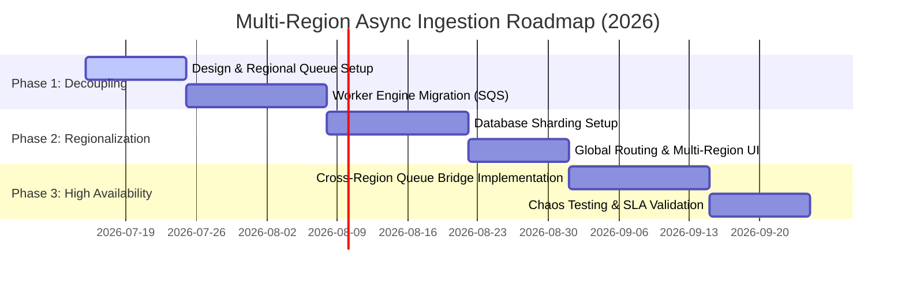

# Multi-Region Scaling Architecture Blueprint — Student Grading Platform
**Generated by Gemini 3.5 Flash**

## 1. Context & Problem Statement
The **AI-Powered Student Grading Platform** is an enterprise platform designed to automate examination scoring across schools and districts. It evaluates exams using sophisticated AI models and maps scores to an extended alphabetical scale from **A++** to **F--**.

### The Challenges
1. **Massive Ingestion Load & Bottlenecks**: The system receives sharp spikes in load, particularly during district-wide exam periods, peaking at **~100,000 events per 5 minutes** (averaging **~333 QPS**). Under the current synchronous/semi-synchronous architecture, these bursts saturate API gateways, exhaust database connection pools, and exceed AI model rate limits.
2. **Single-Region Dependency**: All core services, queues, and databases reside in a single geographic region. This represents a critical single point of failure (SPOF) and fails to address localized compliance/data residency regulations (e.g., GDPR) for student data generated outside the primary region.
3. **The Opportunity**: The system operates under a generous **24-hour processing latency SLA**. This allows us to shift from a real-time synchronous execution model to a highly optimized, resilient, and cost-effective asynchronous multi-region queue-based architecture.

---

## 2. Requirements & Constraints
### Functional Requirements
- **Multi-City and Regional Workflows**: Distinct regional grading standards, rubrics, and language preferences must be respected.
- **Data Isolation**: Student PII, exam submissions, and scored feedback must comply with local residency rules (e.g., EU student data must remain in Europe).
- **Scale-Agnostic Ingestion**: Accept individual test submissions (real-time) and bulk uploads (1,000+ exams) without performance degradation.

### Non-Functional Requirements & SLA Constraints
- **Processing Latency**: 100% of exams must be fully graded and processed within **24 hours** from ingestion.
- **Ingestion Throughput**: Support a continuous ingress of **~333 QPS** with an instantaneous peak burst capability of 3x.
- **Availability**: High availability ($>99.99\%$) for exam ingestion across all active regions.
- **Cost Efficiency**: Minimize compute costs for resource-intensive LLM grading operations.

### Key Assumptions
1. **Eventual Consistency**: Graded scores and feedback do not require global real-time synchronization; they only need to be consistent within their home region within 24 hours.
2. **LLM Provider Regional Limits**: AI API endpoints (e.g., OpenAI, Anthropic, or local LLM gateways) have regional rate limits that must be managed independently.

---

## 3. Current Status
The current architecture (detailed in `Current-Architecture-Overview.md`) is centralized in a single region:
- A centralized **Unified Task Queue** processes both high-priority and normal-priority requests.
- A single SQL Database serves as the central source of truth, causing severe I/O bottlenecks during concurrent write bursts from bulk uploads.
- Any network, regional, or database outage completely halts grading operations globally.

---

## 4. High-Level Target Design
We are implementing **Option 3B: Regional Ingestion + Cross-Region Processing Workers**. This architecture decouples the ingestion layer from the grading engine using regionalized buffers, and handles data residency while allowing cross-region compute sharing.

### Multi-Region Architecture Diagram

```
                        ┌────────────────────────────────────────────────────────┐
                        │                Route 53 / Global DNS                   │
                        │             (Geo-Proximity Routing)                    │
                        └──────────────────────────┬─────────────────────────────┘
                                                   │
                   ┌───────────────────────────────┴──────────────────────────────┐
                   ▼ (Region: US-East-1)                                          ▼ (Region: EU-West-1)
  ┌─────────────────────────────────┐                            ┌─────────────────────────────────┐
  │         US-East Web UI          │                            │          EU-West Web UI          │
  └────────────────┬────────────────┘                            └────────────────┬────────────────┘
                   │                                                              │
                   ▼                                                              ▼
  ┌─────────────────────────────────┐                            ┌─────────────────────────────────┐
  │       US API Gateway            │                            │        EU API Gateway            │
  └────────────────┬────────────────┘                            └────────────────┬────────────────┘
                   │                                                              │
        ┌──────────┴──────────┐                                        ┌──────────┴──────────┐
        ▼                     ▼                                        ▼                     ▼
┌──────────────┐      ┌──────────────┐                         ┌──────────────┐      ┌──────────────┐
│  US High-Pri │      │  US Low-Pri  │                         │  EU High-Pri │      │  EU Low-Pri  │
│  Queue (SQS) │      │  Queue (SQS) │                         │  Queue (SQS) │      │  Queue (SQS) │
└───────┬──────┘      └───────┬──────┘                         └───────┬──────┘      └───────┬──────┘
        │                     │                                        │                     │
        └──────────┬──────────┘                                        └──────────┬──────────┘
                   │                                                              │
                   ▼                                                              ▼
  ┌─────────────────────────────────┐                            ┌─────────────────────────────────┐
  │     US Grading Workers          │◄───────────────────────────┤     EU Grading Workers          │
  │     (Dynamically Scaled)        ├───────────────────────────▶│     (Dynamically Scaled)        │
  └──────┬───────────────────▲──────┘  (Cross-Region Worker Pull │──────┬───────────────────▲──────┘
         │                   │             Fallback Bridge)      │      │                   │
         │ (Writes Local     │ (Reads Templates)                 │      │ (Writes Local     │ (Reads Templates)
         ▼  Student Data)    │                                   ▼      ▼  Student Data)    │
  ┌──────────────┐    ┌──────┴───────┐                            ┌──────────────┐    ┌──────┴───────┐
  │ Local US DB  │    │ Global DB    │                            │ Local EU DB  │    │ Global DB    │
  │  (RDS/SQL)   │    │ (Config, DB  │                            │  (RDS/SQL)   │    │ (Config, DB  │
  │ • Student PII│    │  Replication)│                            │ • Student PII│    │  Replication)│
  │ • Submissions│    │ • Templates  │                            │ • Submissions│    │ • Templates  │
  │ • Score Out  │    │ • Languages  │                            │ • Score Out  │    │ • Languages  │
  └──────────────┘    └──────────────┘                            └──────────────┘    └──────────────┘
```

### Detailed Component Design

#### 1. Global Routing & Regional Ingestion
- **Global DNS Routing (e.g., AWS Route 53)**: Routes client traffic to the nearest geographic API Gateway based on latency/geo-proximity.
- **Regional API Gateways**: Accept student uploads and return an immediate `202 Accepted` status back to the client, along with a secure tracking token.
- **Regional Queue Ingestion (AWS SQS/Kafka)**: Incoming submissions are written directly to regional queues:
  - **High-Priority Queue**: Dedicated to real-time, single-test uploads.
  - **Low-Priority/Batch Queue**: Dedicated to bulk uploads (up to 1,000+ exams).
  *This immediate persistence isolates the database from high write contention, preventing ingestion failure during peaks.*

#### 2. Hybrid Data Layer (Local + Global Storage)
To satisfy both data residency laws (e.g., GDPR, CCPA) and scaling needs, we split the database architecture:
- **Global Database (Read-Replica/Global Table)**: Configured with master-replica architecture. Stores static, non-PII configurations such as exam templates, subject-specific grading rubrics, localization files, and localized feedback templates.
- **Local Regional Databases (Isolated SQL/RDS Instances)**: Act as isolated storage units. Keep all Student PII, raw exam uploads, and final scored feedback strictly within the region of ingestion. 

#### 3. Cross-Region Processing Fleet
- **Grading Workers**: Run in ECS/K8s clusters, pulling directly from their local regional queues.
- **Cross-Region Fallback Bridge**:
  - Under normal loads, US workers drain US queues, and EU workers drain EU queues.
  - In the event of a catastrophic regional outage, or if a region's LLM provider limits are exhausted, workers in the healthy region can dynamically register to pull from the other region's queue.
  - **Security Safeguard**: When a worker processes an out-of-region exam, it acts as a **stateless processor**. It retrieves the rubric globally, queries the LLM API, and writes the resulting grade directly back to the *source* region's database. No local storage of student PII occurs in the processing region.

#### 4. Observability & Self-Healing
- **Queue-Depth Metrics**: Workers auto-scale based on queue depth metrics (`ApproximateNumberOfMessagesVisible` in AWS SQS) rather than CPU/memory utilization.
- **Rate-Limit Backoff**: Workers implement token-bucket rate limiting and exponential backoff to handle external AI model limits.

---

## 5. Alternative Analysis

| Architectural Approach | Key Reasons for Rejection |
| :--- | :--- |
| **Option 1: Active-Active Global SQL Database** | - **High Cross-Region Latency & Contention**: Writing student data globally introduces high consensus overhead.<br>- **Compliance Failures**: Violated GDPR as student data would be replicated globally across US and EU nodes. |
| **Option 2: Cell-Based Isolated Sharding** | - **No Resource Pooling**: If one district had massive final exam spikes, its isolated cell would choke while other regions remained idle.<br>- **High Operational Cost**: Underutilized regional infrastructure. |
| **Option 3A: Centralized Global Message Bus** | - **SPOF Risk**: A single central Kafka/RabbitMQ cluster represents a major vulnerability.<br>- **Compliance Risk**: Exporting raw submissions immediately to a central bus crosses jurisdictional boundaries. |

---

## 6. Testability & Operations

### Testing Strategy (By QE Persona)
1. **Queue Simulation and Load Injection**:
   - Inject synthetic loads of 500k submissions over 15 minutes to verify SQS queuing behavior and ensure the API Gateway remains responsive under peak burst conditions.
2. **Chaos Engineering & Outage Recovery**:
   - Manually block a regional database connection and verify that incoming submissions continue to be safely written to SQS without dropping requests.
   - Simulate an LLM provider outage in Region A to verify that Region B's workers successfully register and drain Region A's SQS queues safely.
3. **Data Residency Auditing**:
   - Verify that cross-region processing workers never persist PII to local disk or cache outside the source region.

### Observability & Cost Balance (By Monitor Persona)
- **Metrics vs Logs Alerting**: 
  - Alert strictly on SQS **Queue Age** (e.g., alert if any message is in queue for $>12\text{ hours}$ to prevent SLA breach) and **In-Flight Message Rates**.
  - Log failures with full contextual details (rubric ID, transaction ID, error stack) for troubleshooting, but exclude student PII.
- **Cost Balancing (Spot Instances)**:
  - Since we have a 24-hour SLA, Grading Workers for the low-priority batch queue will be scheduled strictly on **Spot / Preemptible Instances**. If instances are reclaimed, SQS handles automatic message visibility timeout rollback, and another worker picks up the task. This reduces compute costs by up to **$70\%$**.

---

## 7. Timeline & Milestones



### Milestones
- **Milestone 1 (End of Phase 1)**: Primary region fully decoupled. API Gateway returns immediately, SQS handles ingestion buffer. Peak write load to database reduced by $>90\%$.
- **Milestone 2 (End of Phase 2)**: Dual region (US & EU) active. Databases sharded by region; data residency compliance verified.
- **Milestone 3 (End of Phase 3)**: Active-Active fallback operational. SLA-bound auto-scaling validated under simulated regional failovers.

---

## 8. Risks, Assumptions & Open Questions

| Risk / Assumption | Impact | Mitigation Strategy |
| :--- | :--- | :--- |
| **LLM Provider Global Outage** | **High**: Grading cannot proceed even with healthy regional workers. | Implement a fallback scoring model using lightweight, self-hosted open-source LLMs (e.g., Llama 3) hosted on regional GPU nodes to handle basic grading when premium APIs fail. |
| **Database Sync Lag on Rubrics** | **Medium**: Workers might use outdated grading rubrics if replication lags. | Use Cache-Busting tokens or Rubric Version Identifiers in the SQS message payload. The worker will always check if its cached rubric version matches the message payload version. |
| **Spot Instance Reclaim Frequency** | **Low**: High spot reclaim rate during peak hours might cause duplicate processing. | Ensure worker tasks are highly idempotent. Every grading process must use idempotent upserts based on the `SubmissionID` so that reprocessing an interrupted task is safe and side-effect free. |
